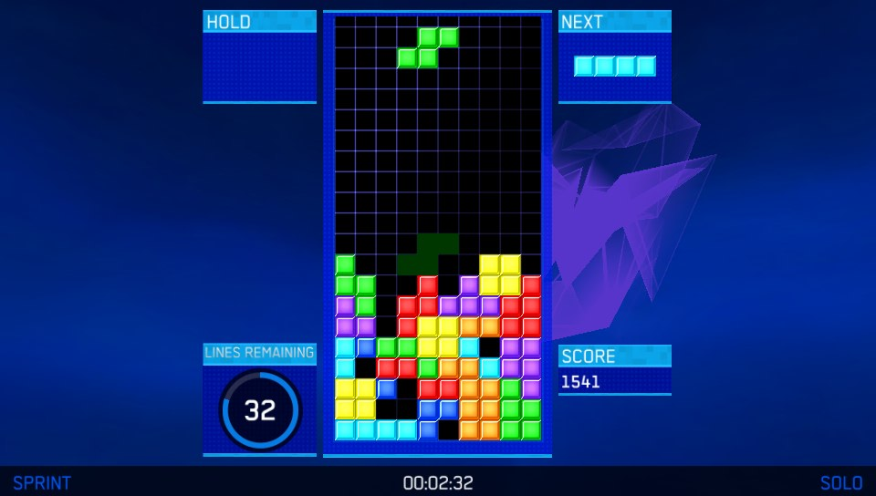
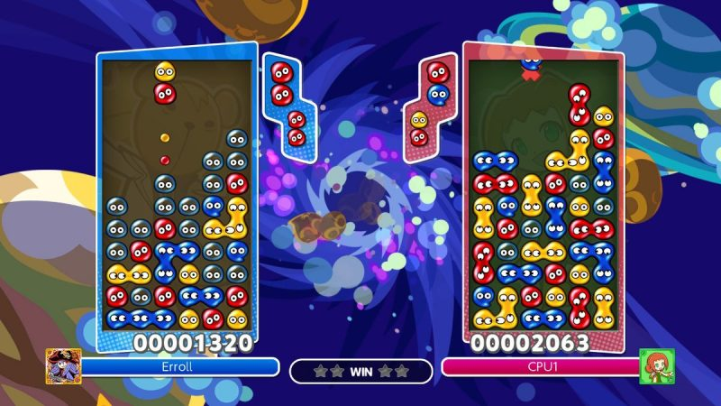

# School of Computing &mdash; Year 4 Project Proposal Form

## SECTION A
Project Title: A faithful recreation of the games Tetris, Puyo Puyo and A.I. development through reinforcement learning.  
Student 1 Name: Gergely Gellert  
Student 1 ID: 17379619  
Student 2 Name: Nevan Oman Crowe  
Student 2 ID: 17407926   
Project Supervisor: Annalina Caputo  

## SECTION B

### Introduction
Our project is split into two distinct parts, the first that we hope to do is creating games based off of Tetris and Puyo Puyo built in Pygame an constucted for the second part. The second part would be to then create, design and train an A.I. to play the games in multiple scenarios such as both singleplayer A.I. games and playing aginst either itself or a human player in multiplayer games.  

We'd hope to cover several different areas in this project across both parts these would include, Game Design, Game Development, A.I. Development and A.I. Training.  

### Outline
We will cover Game Development and Design by creating our own version of Tetris and Puyo Puyo while still staying faithful as we can to the original games.  
The games will include a single player mode that the user or our A.I. can play, or a two player mode where the user can play against another user or against our A.I along with enabling the A.I. to play against itself. We plan on building and designing both games in Python using Pygame which is a set of of Python modules designed for writing video games.
  
The next step in the project would be creating an A.I. that can play our games. Our idea is to teach the A.I. to play our recreation of Tetris and Puyo Puyo to enable it to act as an opponent for the human player. We plan to teach our A.I. to play the games through Reinforcement Learning along with enabling varyibg levels of difficulty for the AI to play at.

### Background
One of our hobbies that we have in common is playing games, along with these we also have an interest in programming and developing A.I. Naturally we tried to figure out where and how these could overlap on a project we could work on. Eventually we settled on building and teaching an A.I. some classic games, these being Tetris and Puyo Puyo. Both of these games have long histories of ebing played by themselves but have recently been merged and played against each other. So we decided it we would take on the extra challange of trying to get our A.I. to learn and play both games.

### Achievements
Our goals with this project is to create a faithful adaptation of both games Tetris and Puyo Puyo. This is so users can play the games and enjoy them and have a competent A.I. opponent. With that in mind our other primary goal would be to create an A.I. that can play both games. Our target audience here users who would like to improve their proformace at playing either games so they can play against a higher skilled opponent without the need of finding someone to play against while also providing different levels of difficulty for less experienced players.

### Justification
The first reason why we believe this will be useful is because we'll learn how to properly program and develop an A.I. that can be multifunctional and learn how to do various tasks. This will be useful as in the modern world there's been a huge push towards lots of A.I. development in the industry, for example analysis trends in data is usually done by A.I. We would also be a useful starting point and experince for any future A.I. development we'd plan in the future.

The second reason is this would give us some experience developing games, working with different programming modules to build them. This could be invaluable as its a another industry we can potentially end up working in after college. This program would give users who enjoy playing Tetris or Puyo Puyo a chance to play a game they like. And if they really want to improve their ability at the game they can also challange themselves to play against an A.I. as practice.

### Programming language(s)
Python 3.7+

### Programming tools / Tech stack
Python 3.7+  
We have decided to use Python because it's widely used in developing A.I. in the industry and we would like some experience creating it.  

Pygame  
We have decided to use Pygame as our base library for creating our games as it's widely used for projects like these and it would be hugely benefical to learn how to us it.

### Hardware
None

### Learning Challenges
There would be plenty of new challenges to this project that we would have to overcome and have to learn to do this project. These are split across both parts of the projet with each part having their own learning curves.

The learning process around building and designing both the games revolves around having to learn the modules contained within Pygame and how to use them effectly to build the games. We also need to learn about game design itself and how to build a functioning and well designed recreation of the classic games.

The amount learning involved with the A.I. design and construction is large, we'd have to read and learn about A.I. constuction in terms of both reinforcement learning in general but also how to reconstruct these teachings in Python. Along with this we'd have to learn about the best practices related to game theory and how to properly build the A.I. properly to suit both games.

### Breakdown of work

#### Gergely Gellert

I will start off this project by creating a very rough version of Tetris. This rough version of Tetris wil include the basic game, working controls and a way for our A.I. to make analysis the board state so it can make decisions based off of that data. This rough game will be made in Pygame through Python.  
  
Once a rough base for both games are established I will start developing the A.I. that will learn how to play the games we created. This will involve doing prior research into Reinforcement Learning and with advice from our supervisor possibly Deep Q-Learning. This will come in the form of reading books on the subjects and general research over the internet. We're currently planning to create the A.I. in Python as it's a widely used language for creating A.I's. It might also help alleviate some compatibility issues with our games as they will also be coded in Python.  
  
If I end up finishing development of the A.I. early with some time to spare, or the workload for the game's development has fallen significantly behind, I will shift to help out my partner in doing any unfinished work.  

#### Nevan Oman Crowe
My plan for the split of work is to first develop a rough version of Puyo Puyo including basic controls and functionality of the game using Pygame and Python, this is to enable the A.I. development by my partner.

I would also have to research and expand my knowledge on good game design practices, furthering on from this I would start working on expanding the features and functionality of both of the rough games. This would involve development of advanced features of the said games such as multiplayer game modes along with creating a more polished art style and UI to enable a more user friendly experience. Should my work be completed or more work is needed on the A.I. development my workload would shift to further assist my partner.

The development of the games design would be our own recreation of Tetris and Puyo Puyo based of their already established designs shown below

## Examples

  
  

